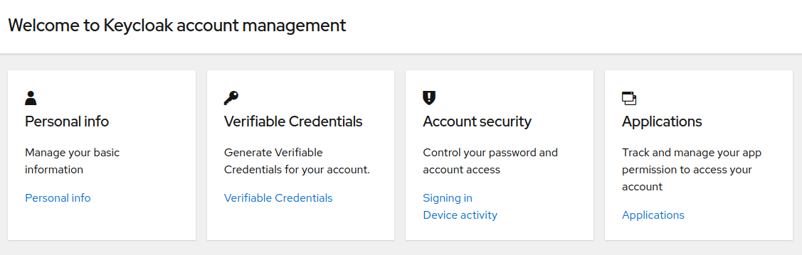
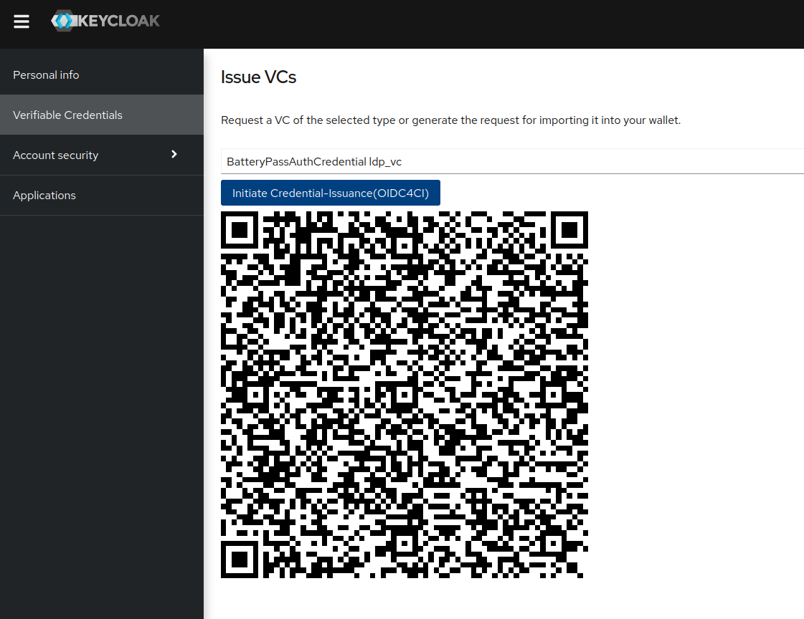

# Keycloak VC-Issuer

The Keycloak-VC-Issuer is plugin for [Keycloak](https://www.keycloak.org/) to
support [SIOP-2](https://openid.net/specs/openid-connect-self-issued-v2-1_0.html)/ [OIDC4VP](https://openid.net/specs/openid-4-verifiable-presentations-1_0.html)
clients and issue [VerifiableCredentials](https://www.w3.org/TR/vc-data-model/) through
the [OIDC4VCI-Protocol](https://openid.net/specs/openid-4-verifiable-credential-issuance-1_0.html)
to compliant wallets.

[](https://www.fiware.org/developers/catalogue/)
[](https://opensource.org/licenses/Apache-2.0)<br>
[](https://quay.io/repository/fiware/keycloak-vc-issuer)
[](https://github.com/FIWARE/keycloak-vc-issuer/actions/workflows/integration-test.yml)
[](https://github.com/FIWARE/keycloak-vc-issuer/actions/workflows/test.yml)

## Contents

- [Background](#background)
    - [Compatibility](#compatibility)
    - [OpenID for Verifiable Credential Issuance(OIDC4VCI)](#openid-for-verifiable-credential-issuance)
- [Install](#install)
    - [Jar-File](#jar-file)
    - [OCI-Container](#oci-container)
    - [UI-Integration](#ui-integration)
    - [WaltId-SSIKit](#waltid-ssikit)
    - [Configuration](#configuration)
- [Usage](#usage)
    - [API](#api)
    - [Protocol](#protocol)
    - [Configure Claims for Credential-Types](#configure-claims-for-credential-types)
      - [Static values](#static-values)
      - [Dynamic values](#dynamic-values)
- [Demo](#demo)
- [Testing](#testing)
  - [Unit-Testing](#unit-testing)
  - [Integration-Testing](#integration-testing)
  - [Compatibility-Testing](#compatibility-testing)
- [License](#license)

## Background

[Keycloak](https://www.keycloak.org/) is a well established OpenSource Identity Management System. It's relied on in
numerous environments and serves credentials and secrets to be used in different protocols, for different types of
clients. While a VerifiableCredentials-based decentralized Identity Management does not necessarily require an IDM, a
component to issue credentials to users is required. Since Keycloak already provides capabilities for managing users,
clients and their roles, it's well suited to also serve VerifiableCredentials. The Keycloak-VC-Issuer therefor extends
the Keycloak-APIs with such functionality and provides a [theme](./theme) that extends the Account Console with a UI for
issuance of credentials to users.

### Compatibility
 
The plugin is developed with the [20.0.3 libraries](https://github.com/keycloak/keycloak/tree/20.0.3) and tested against
all Keycloak Minor-Releases >=18.0.0. Please check the [Compatibility-Matrix](./doc/compatibility/compatibility.md) for
more information. The matrix gets updated every night.

### OpenID for Verifiable Credential Issuance

The plugin targets compliance with
the [OpenID for Verifiable Credential Issuance(OIDC4VCI)](https://openid.net/specs/openid-4-verifiable-credential-issuance-1_0.html)
standard, in order to be compatible with Wallets complying with
the [European Digital Identity Wallet Architecture and Reference Framework](https://digital-strategy.ec.europa.eu/en/library/european-digital-identity-wallet-architecture-and-reference-framework)
and any other standard-conformant Wallet-implementation. As of now, it supports the following parts of the spec:

- [3.5 Pre-Authorized Code Flow](https://openid.net/specs/openid-4-verifiable-credential-issuance-1_0.html#name-pre-authorized-code-flow):
    - in order to securely issue credentials, the plugin can offer pre-authorized authorization codes to authenticated
      users
    - the code is connected to the user-session that requested
      the [Credential Offer](https://openid.net/specs/openid-4-verifiable-credential-issuance-1_0.html#name-credential-offer)
    - the code can be exchanged for an access-token through a token-endpoint as described
      in [RFC 6749](https://www.rfc-editor.org/info/rfc6749)
- [4. Credential Offer Endpoint](https://openid.net/specs/openid-4-verifiable-credential-issuance-1_0.html#name-credential-offer-endpoint):
    - to initiate standard conformant issuance, an endpoint to
      retrieve [Credential Offer](https://openid.net/specs/openid-4-verifiable-credential-issuance-1_0.html#name-credential-offer)
      is provided
    - the endpoint is available at ```/realms/{realm-id}/verifiable-credential/{issuer-did}/credential-offer/{nonce}```. Nonce should be
      retrieved from the endpoint ```/realms/{realm-id}/verifiable-credential/{issuer-did}/credential-offer-uri```, which accepts the type
      and format of the credential
    - see [api-spec](./api/api.yaml) for more
- [6. Token Endpoint](https://openid.net/specs/openid-4-verifiable-credential-issuance-1_0.html#name-token-endpoint)
    - supports token exchange through the pre-authorized flow
    - available per issuer at ```/realms/{realm-id}/verifiable-credential/{issuer-did}/token```
    - see [api-spec](./api/api.yaml) for more
    - pin-check is currently not supported
- [7. Credential Endpoint](https://openid.net/specs/openid-4-verifiable-credential-issuance-1_0.html#name-credential-endpoint)
    - provides a valid credential, according to the requested type and format
    - currently supports jwt_vc_json, jwt_vc_json-ld, ldp_vc and for backward-compatibility jwt_vc(which defaults to
      jwt_vc_json)
    - proof-checking for the request is only supported for proof-type jwt(yet)
- [10.2. Credential Issuer Metadata](https://openid.net/specs/openid-4-verifiable-credential-issuance-1_0.html#name-credential-issuer-metadata)
    - provides the metadata for the issuer

## Install

> :warning: Since this is a plugin for Keycloak, having an instance of Keycloak running is a logical precondition.
> See [the official Keycloak-Documentation](https://www.keycloak.org/guides#server) on how to set it up.

### Jar-File

The VC Issuer is a fully-self-contained provider, thus its jar-file only has to be added to the ```providers```-folder
of Keycloak(typically under ```/opt/keycloak/providers```). Keycloak will automatically pick up the provider at
start-time. The plugin is available as jar-file
through [the github-releases](https://github.com/fiware/keycloak-vc-issuer/releases).

### OCI-Container

In order to ease the deployment in containerized environments, a container including the jar-file is available
at [quay.io](https://quay.io/repository/fiware/keycloak-vc-issuer). The container can be used in containerized
environments, to copy the jar file into a Keycloak instance, without having to manipulate the Keycloak-Image itself. An
example usage of the container as an init-container in Kubernetes setups can be found in
the [integration test-setup(based on k3s)](./src/test/k3s).

### UI-Integration

To have the functionality integrated into the account-console, the ```SIOP-2```-theme has to be enabled for the realm:


### WaltId-SSIKit

In addition to Keycloak, an installation of the [WaltID-SSIKit](https://github.com/walt-id/waltid-ssikit) needs to be
provided. WaltId manages the requiered [decentralized identifiers](https://www.w3.org/TR/did-core/) and creates the
actual credentials based on templates. It can f.e. be deployed
via [Helm-Chart](https://github.com/i4Trust/helm-charts/tree/main/charts/vcwaltid) or as a
plain [docker-container](https://hub.docker.com/r/waltid/ssikit).

All CredentialTypes to be supported by the SIOP-2 clients need to have a corresponding template in WaltId.
See [WaltId Templates](https://docs.walt.id/v/ssikit/concepts/credential-templates)
for details about the templating and
the [helm-chart](https://github.com/i4Trust/helm-charts/blob/main/charts/vcwaltid/values.yaml#L354) as an example to
provide them.

### Configuration

In order to provide the capabilities of issuing VerifiableCredentials and handling DIDs, Keycloak relies
on [Walt-ID](https://github.com/walt-id/waltid-ssikit) as a downstream component.
The [integration-test setup](src/test/k3s) provides an example on how to run and integrate it. The configuration is
provided via environment variables:

|Name| Description                                                                          | Default    |
|----|--------------------------------------------------------------------------------------|------------|
|VCISSUER_WALTID_ADDRESS| Base address of walt-id. Has to include the protocol.                                ||
|VCISSUER_WALTID_CORE_PORT| Port to be used for connecting the walt-id's core-api.                               | ```7000``` |
|VCISSUER_WALTID_SIGNATORY_PORT| Port to be used for connecting the walt-id's signatory-api.                          | ```7001``` |
|VCISSUER_ISSUER_DID| DID to be used for issuing credentials. If none is provided, Keycloak will create one. | |
|VCISSUER_ISSUER_KEY_FILE| Path to the file containing the issuer key.                                          | |

## Usage

The VC-Issuer plugin provides an integration for [VerifiableCredentials](https://www.w3.org/TR/vc-data-model/)
into [Keycloak](https://www.keycloak.org/). It allows managing potential receivers of VerifiableCredentials
as [SIOP-2 Clients](https://openid.net/specs/openid-connect-self-issued-v2-1_0.html), allowing to manage users and roles
in the well-known Keycloak way. In addition to that, it provides the endpoints for (authenticated) users to receive
VerifiableCredentials for their account. To integrate with the Account-Console frontend, a theme(```siop-2```) is
included.

### API

The plugin provides multiple endpoints through its API ([see OpenApi-Doc](./doc/api.yaml)) as a realm resource. They
seperate into two categories. See the [see OpenApi-Doc](./doc/api.yaml) for detailed information and examples:

- [OpenID for Verifiable Credential Issuance](https://openid.net/specs/openid-4-verifiable-credential-issuance-1_0.html)
  compatible endpoints - tag ```OIDC4VCI```
- convenience endpoints to allow a more comfortable frontend integration - tag ```IssuerPlugin```

Most endpoints are only available to authenticated users, the following three informatory endpoints are publicly
available:

- /{issuerDid}/.well-known/openid-credential-issuer - provides the issuer metadata in an OIDC4VCI compliant way
- /{issuerDid}/.well-known/openid-configuration - provides the openid-configuration in an OIDC4VCI compliant(and
  therefor als [RFC8414](https://www.rfc-editor.org/info/rfc8414) compliant) way
- /issuer - provides just the did of the configured issuer, that can be used to construct the other paths. Provided to
  ease frontend integrations

### Protocol

The provider does support the protocol-type ```SIOP-2```, therefore such clients can be created and managed. Since
integration into the Admin-Console is still open, the clients need to be created through the api. A registration will
look like:

```json
{
  "clientId": "did:key:z6Mkv4Lh9zBTPLoFhLHHMFJA7YAeVw5HFYZV8rkdfY9fNtm3",
  "enabled": true,
  "description": "Client to receive Verifiable Credentials.",
  "protocol": "SIOP-2",
  "supportedVCTypes": [
    {
      "type": "PacketDeliveryService",
      "format": "ldp_vc"
    },
    {
      "type": "PacketDeliveryService",
      "format": "jwt_vc_json"
    }
  ]
}
```

Alternatively, the client can also be directly create through the clients api(for example when using declarative
configuration via [keycloak-config-cli](https://github.com/adorsys/keycloak-config-cli), find an
example [here](https://github.com/FIWARE-Ops/fiware-gitops/tree/master/aws/dsba/animal-goods/keycloak)):

```json
 {
  "clientId": "did:key:z6MkigCEnopwujz8Ten2dzq91nvMjqbKQYcifuZhqBsEkH7g",
  "enabled": true,
  "description": "Client to receive Verifiable Credentials",
  "surrogateAuthRequired": false,
  "alwaysDisplayInConsole": false,
  "clientAuthenticatorType": "client-secret",
  "defaultRoles": [],
  "redirectUris": [],
  "webOrigins": [],
  "notBefore": 0,
  "bearerOnly": false,
  "consentRequired": false,
  "standardFlowEnabled": true,
  "implicitFlowEnabled": false,
  "directAccessGrantsEnabled": false,
  "serviceAccountsEnabled": false,
  "publicClient": false,
  "frontchannelLogout": false,
  "protocol": "SIOP-2",
  "attributes": {
    "expiryInMin": "3600",
    // attributes are of type "string": "string", thus we provide the prefixed-type, together with a comma-seperated list of formats 
    "vctypes_BatteryPassAuthCredential": "ldp_vc,jwt_vc_json",
    // in order to provide static values to the credentials template, fields of structur vc_<claim-name> will be provided to the credential
    "vc_subjectDid": "did:web:my.did.de",
    // defines the claims to be included in the given credential type
    "BatteryPassAuthCredential_claims": "email,firstName,roles,subjectDid"
  },
  "authenticationFlowBindingOverrides": {},
  "fullScopeAllowed": true,
  "nodeReRegistrationTimeout": -1,
  "defaultClientScopes": [],
  "optionalClientScopes": []
}
```

Once the client is created, roles and role-assignemnts can be managed the same way as for every other type, through the
API or the Admin-Console.

### Configure claims for Credential-Types

Depending on the credentials type and the used template(
see [WaltId documentation](https://docs.walt.id/v/ssikit/concepts/credential-templates)), Keycloak can provide either
static or dynamic values to the credential.

#### Static values

Static values can be configured on a "per-client"-base. Every client attribute, that is prefixed with "vc_" will be
provided to the resource provider and can be used for the credential. F.e.:

```json
{
  ...
  attibutes: {
    ...
    "vc_myFirstClaim": "first",
    "vc_mySecondClaim": "second",
    "CredentialType1_claims": "myFirstClaim",
    "CredentialType2_claims": "myFirstClaim,mySecondClaim"
  }
}
```

The configuration would provide the 2 claims ```myFirstClaim``` and ```mySecondClaim``` with the static
values ```first``` and ```second``` to the credentials provider. They are used in credentials that are configured to be
supported. For each credentials type, a comma-separated list of claim-names can be provided. They have to either
correspond to one of the statically configured one or need to be available as dynamic claims.

#### Dynamic Values

The Credential Provider supports some claims, filled by the user-attributes available:

- ```email``` - if an email address is configured for the user, it can be via the claim ```email```
- ```firstName``` - if the user has a firstName set, it can be via the claim ```firstName```
- ```familyName``` - if the user has a firstName set, it can be via the claim ```familyName```
- ```roles``` - to use the credentials in authorization frameworks, roles can be provided to the credential. ```roles```
  will include all roles configured for the user in the given client

## Demo

In order to issue credentials, first a SIOP-2 client has to be created. Integration in the admin-console is still open,
thus has to be done through the api:

```shell
url --location --request POST '<KEYCLOAK_HOST>/realms/master/clients-registrations/SIOP-2' \
--header 'Authorization: Bearer <TOKEN>' \
--header 'Content-Type: application/json' \
--data-raw '{
    // did of the client
    "clientDid": "did:key:z6MkmxVQztpb1JpAEgfJaqFN5g7CcJFPSMsJ1S6PiBjxR7Vxp",
    // type of the supported credentials
    "supportedVCTypes": [
        {
          "type": "PacketDeliveryService",
          "format": "ldp_vc"
        },
        {
          "type": "PacketDeliveryService",
          "format": "jwt_vc_json"
        }
    ],
    // 'traditional' description
    "description": "Client to receive Verifiable Credentials.",
    // max lifetime of the VC
    "expiryInMin": 3600,
    // additionalClaims to be added to the VC
    "additionalClaims": {
        "a":"b",
        "c":"d"
    }
}'
```

Client in the console:


Once the client is created, it is available in the admin-console. Through the standard interfaces, client-roles can be
created and assigned to users. Once that is done, a logged in user can use the account-interface to get Verifiable
Credentials:

Account-Console overview:



Get a VC:



The displayed QR provides a URI-formatted reference to the OIDC4VCI compatible credential-offer, that can be scanned and used by
compliant wallets. For demonstrational purposes, the [demo-wallet.fiware.dev](https://demo-wallet.fiware.dev) can be
used. It's [browser based wallet](https://github.com/FIWARE/VCWallet), intended to be used in demo-scenarios, not
suitable for real-world use-cases.

### The Cross-Device Flow

The example shows a "Cross-Device Flow", as described by  [OIDC4VCI](https://openid.net/specs/openid-4-verifiable-credential-issuance-1_0.html#name-credential-offer-cross-devi). 
See the following diagramm for the detailed flow: 


## Testing

### Unit-Testing

The unit-tests are located at [src/test/java](./src/test/java) and are postfixed with ```Test```. The tests
use [Junit5](https://junit.org/junit5/docs/current/user-guide/)
and [Mockito](https://site.mockito.org/) and will cover the essential logic inside the plugin.

### Integration-Testing

Since the plugin has to work as part of [Keycloak]((https://www.keycloak.org/)) and does
use [WaltId](https://docs.walt.id/v/ssikit/ssi-kit/readme)
as a downstream dependency, integration-test are essential. The tests use a [k3s](https://k3s.io/) setup, integrated
through the [k3s-maven-plugin](https://github.com/kokuwaio/k3s-maven-plugin), which provides a preconfigured Keycloak
and WaltId environment. The manifests can be found at [src/test/k3s](./src/test/k3s). The test implementations are
postfixed with ```IntegrationTest```. To run the full integration test suite, use the maven
profile ```integration-test```:

```shell
mvn clean install -Pintegration-test
```

This will automatically build and deploy the current development, bind selected services to localhost and run all
integration-tests. To support local development, the same test-setup can be run locally via:

```shell
mvn clean install -Pdev
```

This will not tear-down the environement after the excution, thus can be used for testing/debugging from the IDE.
See [pom.xml](pom.xml)-Profile ```dev```-```k3s-maven-plugin``` for the available ports.

### Compatibility-Testing

To ensure compatibility with released Keycloak-Versions, the integration-tests support exectuion with different
Keycloak-Versions. In order to execute the tests with a specific version, provide either the
property ```keycloak.version```(which has to be a valid tag from the [official quay-image](quay.io/keycloak/keycloak))
or ```keycloak.image```. Be aware that the configuration might differ for different builds of Keycloak, thus alternative
images might require some additional changes in the k3s-setup. The compatibility tests are executed as part of the
pipeline and additionally once every night. The results can be found
at [the compatibility-matrix](./doc/compatibility/compatibility.md)

## License

Keycloak VC-Issuer is licensed under the Apache License, Version 2.0. See LICENSE for the full license text.

© 2023 FIWARE Foundation e.V.
